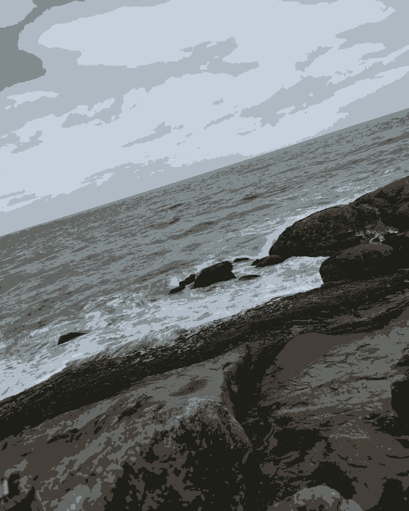
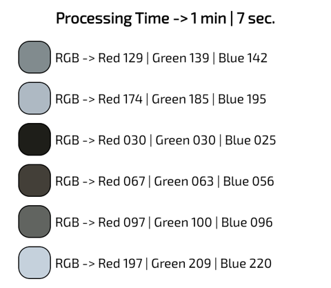

# Image Cluster App
This application had as its main idea to apply fundamentals of artificial intelligence in a mobile project.

## Context

Based on the algorithms learned in class, I decided to create an application in which it would be possible to add an image and select the number of clusters (Colors) that it will have.
This makes it possible to run the KMeans Algorithm that will group all the pixels and select their "Representative", thus being able to replace them at the end of the process, thus creating a new image.

## Example
### Original

### Same Image with 6 Clusters

## Libs
- [Android Jetpack](https://developer.android.com/jetpack)
- [CameraX](https://developer.android.com/training/camerax)
- [smile-kotlin -> KMeans](http://haifengl.github.io/api/kotlin/smile-kotlin/smile.clustering/kmeans.html)
## Features
- [x] Image Insertion
- [x] Image Clustering
- [x] Select N Clusters
- [x] Run multiple times without restarting
- [x] Save Clustered Image
- [x] Color listing (Centroids)
- [ ] Fix out of memory with large images